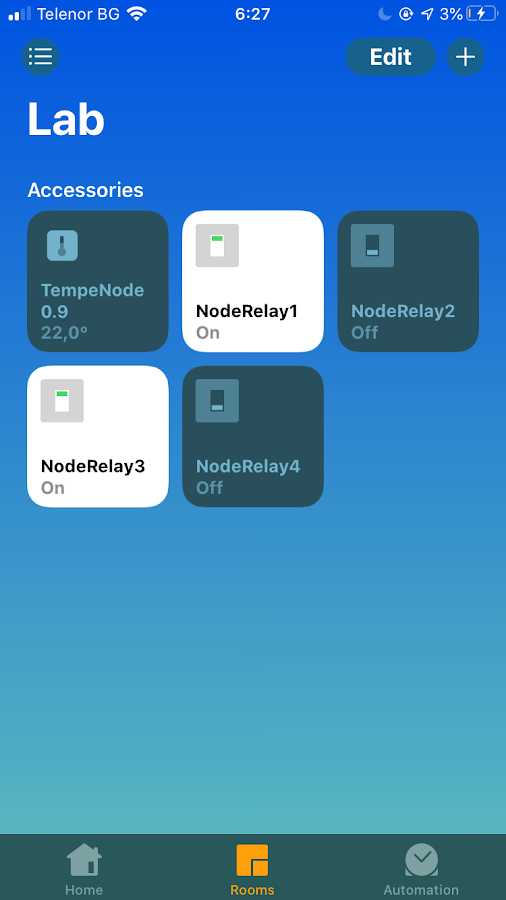
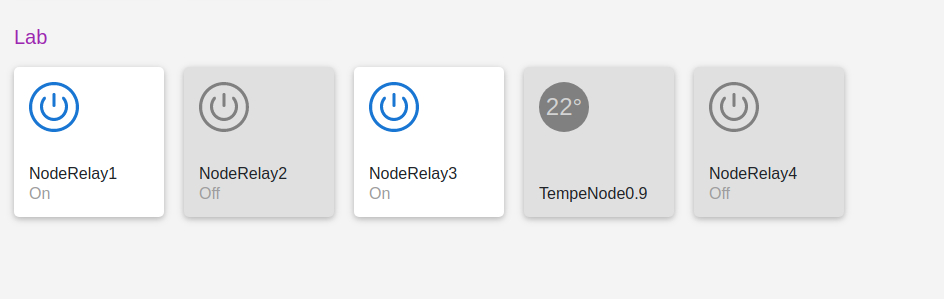
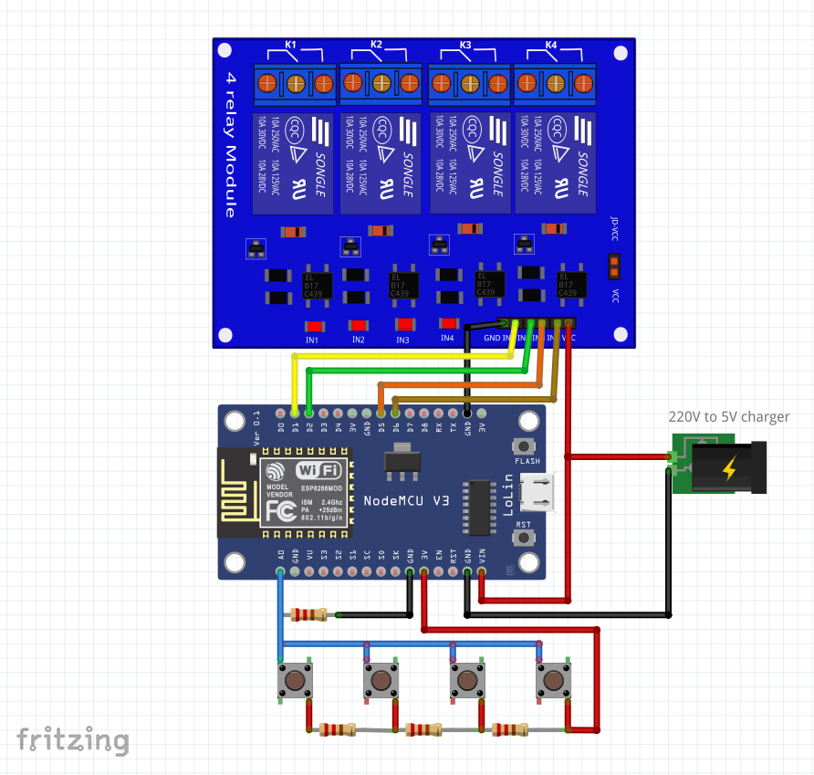
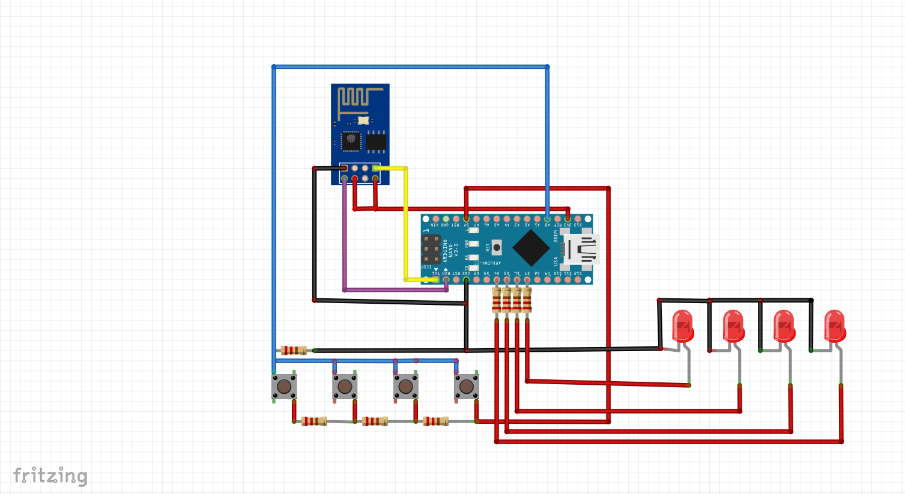
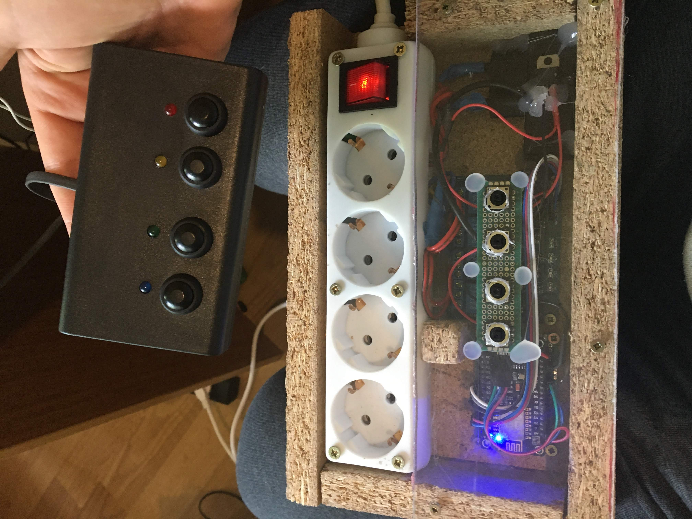
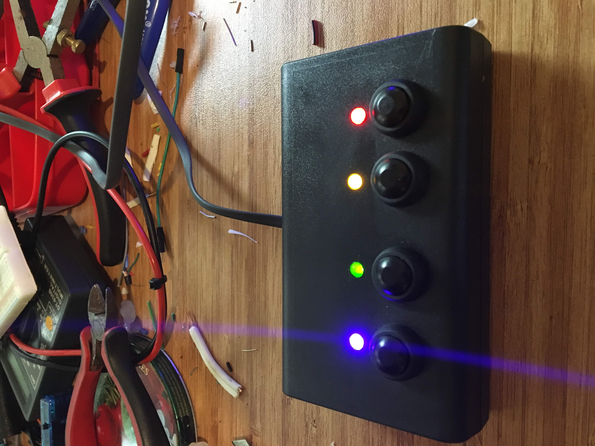
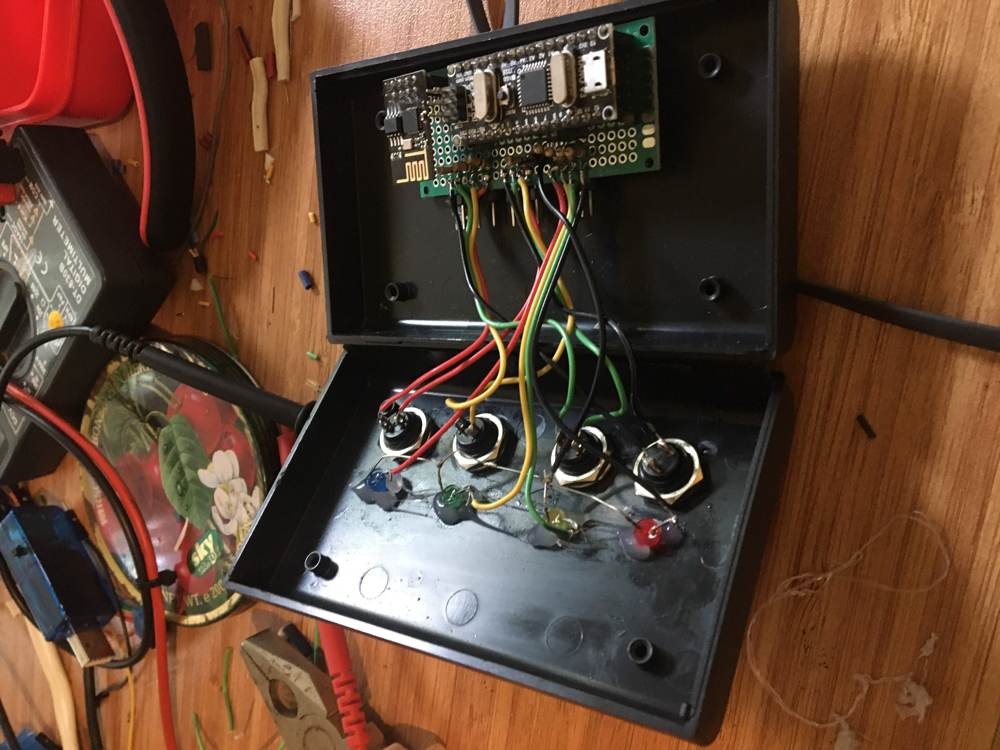
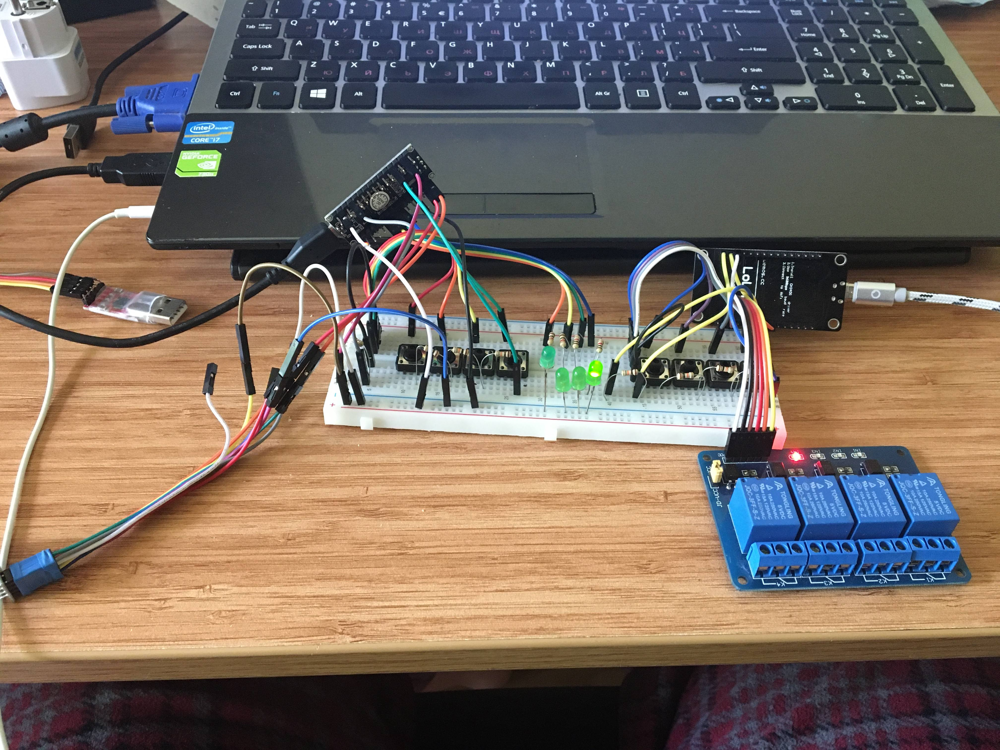

# nodemcu_4relay_arduino_nano_remote
Control 4 relays using nodemcu and arduino nano in combination with esp8266-01 like a remote control. 

It supports homekit (homebridge with homebridge-mqtting plugin and http web requests)

## Homekit using homebridge

## Components

* [Nodemcu(esp8266)](https://www.aliexpress.com/item/32665100123.html?spm=a2g0o.productlist.0.0.42776da0ida6XS&algo_pvid=8e9df5dc-7034-4056-88be-44a6ae82861a&algo_expid=8e9df5dc-7034-4056-88be-44a6ae82861a-0&btsid=0ab50f0815886721876876938e7633&ws_ab_test=searchweb0_0,searchweb201602_,searchweb201603_)
* [4 Relay module](https://www.aliexpress.com/item/32997387727.html?spm=a2g0o.productlist.0.0.3d9b67d8roEOY7&algo_pvid=91d9827f-60df-435a-a0e0-3897abc01b3d&algo_expid=91d9827f-60df-435a-a0e0-3897abc01b3d-0&btsid=0ab6f83915887361608052318e1946&ws_ab_test=searchweb0_0,searchweb201602_,searchweb201603_)
* [esp8266-01](https://www.aliexpress.com/item/4000505567851.html?spm=a2g0o.productlist.0.0.3e687c65GON72f&algo_pvid=dc6d9c4d-d8df-4026-ae05-5cc4148799ff&algo_expid=dc6d9c4d-d8df-4026-ae05-5cc4148799ff-2&btsid=0ab6f82215887362050591883e23d5&ws_ab_test=searchweb0_0,searchweb201602_,searchweb201603_)
* [arduino nano](https://www.aliexpress.com/item/32866959979.html?spm=a2g0o.productlist.0.0.66bb4442badRpE&algo_pvid=b7d2b08e-e57d-4b40-b798-241149c360bf&algo_expid=b7d2b08e-e57d-4b40-b798-241149c360bf-0&btsid=0ab6fb8315887362515376039e9bd1&ws_ab_test=searchweb0_0,searchweb201602_,searchweb201603_)
* 8 10K resistors
* 4 100K resistors
* 4 push buttons
* broken 5v charger or any [220v to 5v module](https://www.aliexpress.com/item/32853634328.html?spm=a2g0o.productlist.0.0.770b1c57LjdNh6&algo_pvid=cb2aad54-5180-4fc3-99ee-b90d8aadf3dd&algo_expid=cb2aad54-5180-4fc3-99ee-b90d8aadf3dd-0&btsid=0ab6d69515886723154778746e6ce8&ws_ab_test=searchweb0_0,searchweb201602_,searchweb201603_)

## Circuit diagram
### Nodemcu with 4 relays control

### Remote control

## Finished Project

